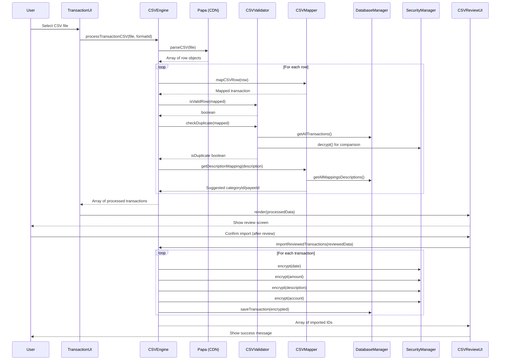
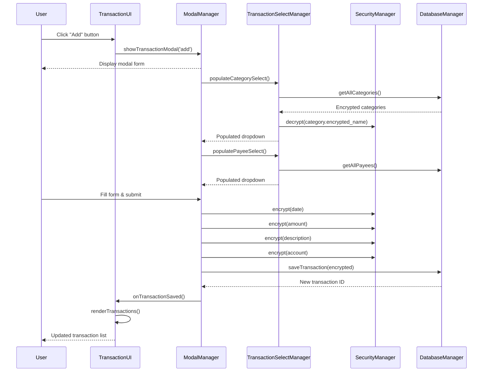
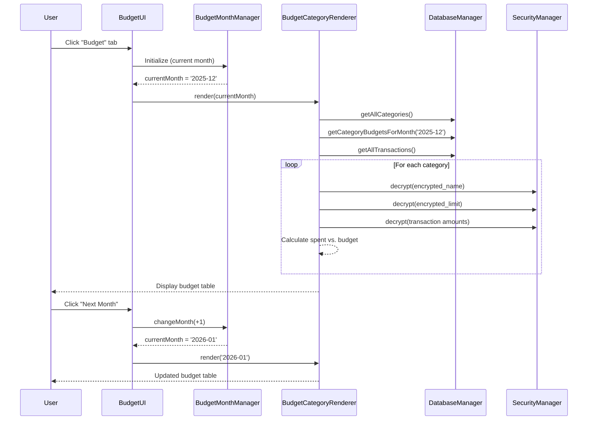
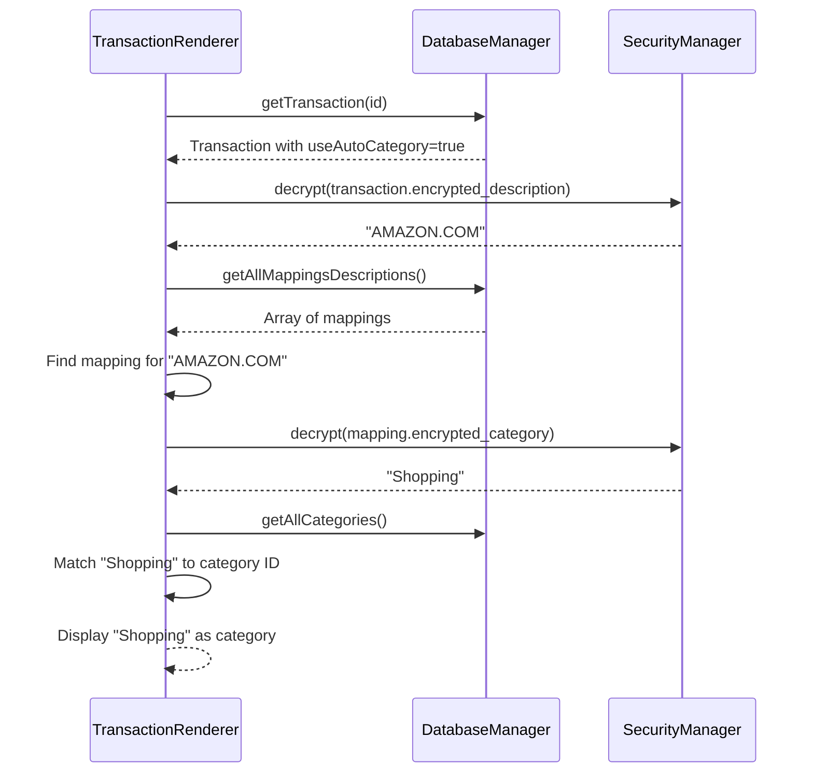
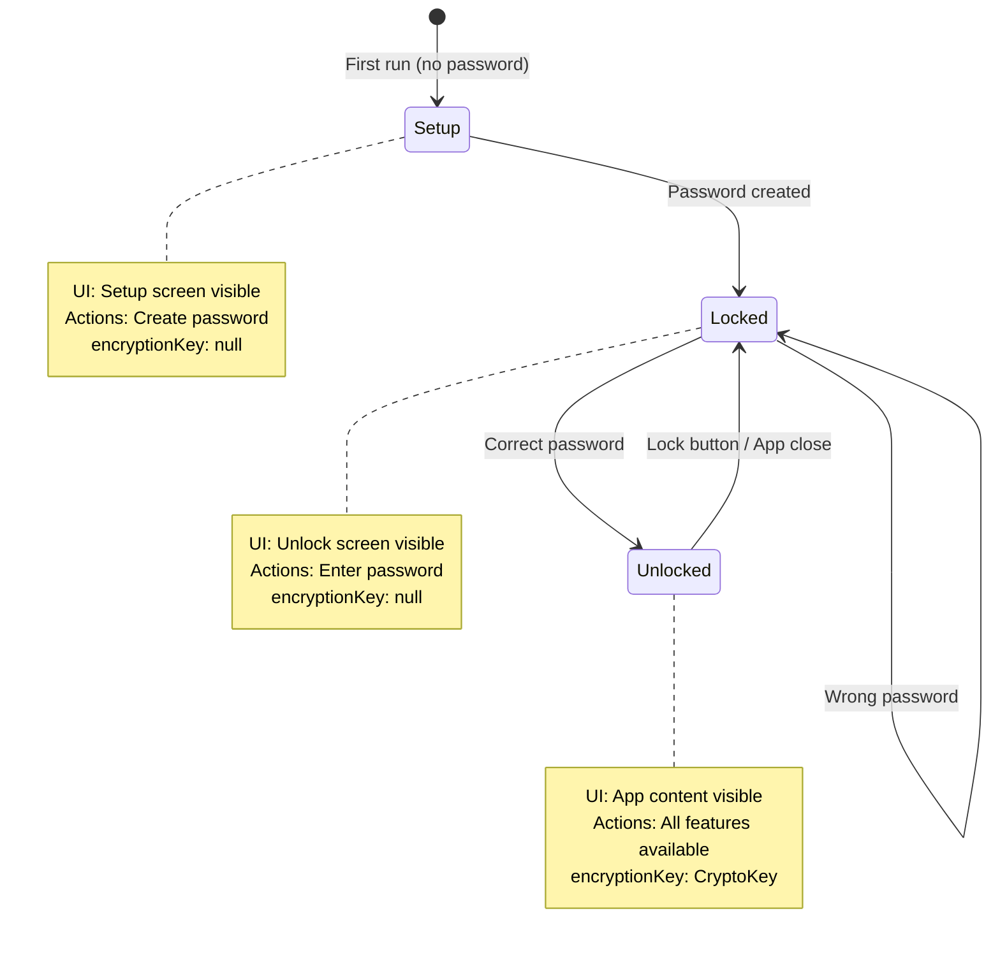
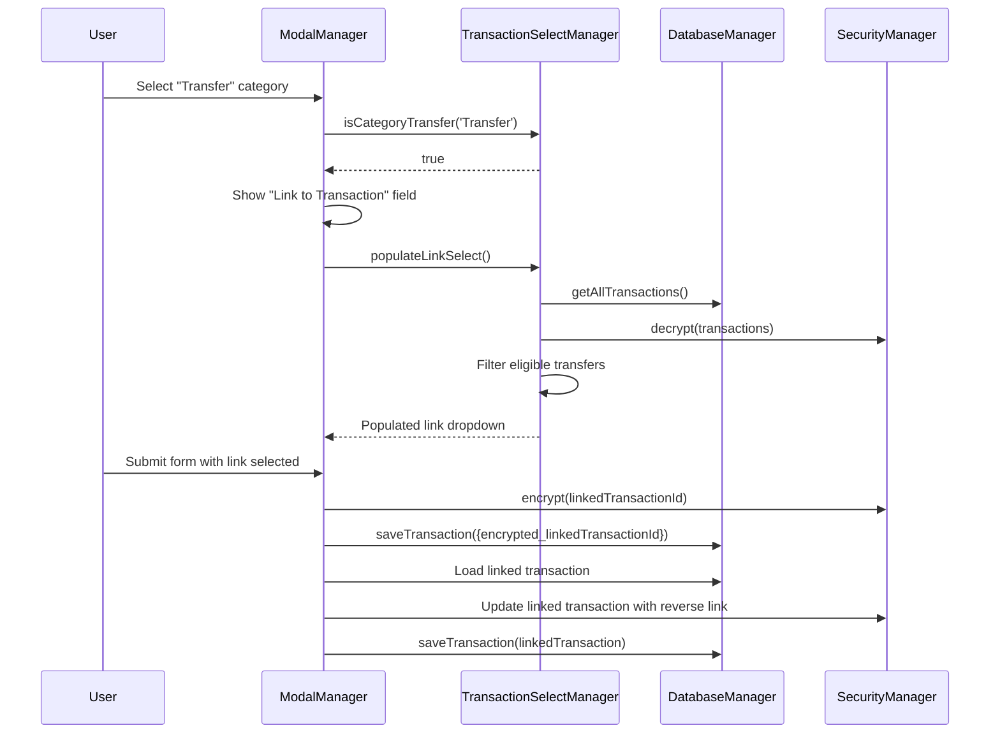

# Data Flow Diagrams

**Purpose:** Visual and textual documentation of complex feature flows  
**Use When:** Understanding multi-step operations, debugging, or implementing similar features  
**Last Updated:** 2025-12-30

---

## Table of Contents
1. [CSV Import Flow](#csv-import-flow)
2. [Transaction CRUD Flow](#transaction-crud-flow)
3. [Budget Management Flow](#budget-management-flow)
4. [Category Auto-Mapping Flow](#category-auto-mapping-flow)
5. [State Transition Flow](#state-transition-flow)
6. [Transfer Transaction Linking Flow](#transfer-transaction-linking-flow)

---

## CSV Import Flow

### Overview
Import transactions from CSV file → Parse → Validate → Review → Encrypt → Save to database

### Sequence Diagram


### Step-by-Step Flow

#### Step 1: File Selection
- **Trigger:** User clicks import button, selects CSV file
- **Entry Point:** `TransactionUI.handleImportCSV()`
- **File Format:** Expects CSV with headers (Capital One format by default)

#### Step 2: CSV Parsing
- **Method:** `CSVEngine.parseCSV(file)`
- **Library:** Papa Parse (global CDN variable)
- **Output:** Array of row objects `[{Date: '...', Amount: '...', ...}]`
- **Configuration:** `header: true, skipEmptyLines: true`

#### Step 3: Row Processing
- **Method:** `CSVEngine.processTransactionCSV(file, formatId)`
- **Per Row:**
  1. **Map columns** → `CSVMapper.mapCSVRow(row)` 
     - Normalizes column names (case-insensitive)
     - Extracts: date, description, amount, accountNumber, transactionType
  
  2. **Validate** → `CSVValidator.isValidRow(mapped)`
     - Checks for required fields
     - Skips empty rows
  
  3. **Check duplicate** → `CSVValidator.checkDuplicate(mapped)`
     - Compares date + description + amount with existing transactions
     - Decrypts existing transactions for comparison
     - Returns `isDuplicate: boolean`
  
  4. **Suggest category** → `CSVMapper.getDescriptionMapping(description)`
     - Looks up description in mappings_descriptions table
     - Decrypts category name from mapping
     - Resolves category ID (or 'TRANSFER')
  
  5. **Suggest payee** → From same mapping
     - Decrypts payee name
     - Finds or creates payee ID
  
  6. **Get account name** → `CSVMapper.getAccountMapping(accountNumber)`
     - Looks up account number in mappings_accounts table
     - Returns friendly name or default

#### Step 4: Review Screen
- **Component:** `CSVReviewUI`
- **Data Passed:** Array of `ProcessedTransaction` objects:
  ```javascript
  {
      date: '2025-12-30',
      description: 'GROCERY STORE',
      amount: -50.00,
      accountNumber: '1234',
      accountName: 'Chase Checking',
      suggestedCategoryId: 5,
      suggestedPayeeId: 10,
      isDuplicate: false,
      originalRow: {...}
  }
  ```
- **User Actions:**
  - View all transactions in table
  - Filter by category, duplicate status
  - Override suggested category/payee
  - Mark individual transactions to skip
  - Optionally save new mappings

#### Step 5: Import to Database
- **Method:** `CSVEngine.importReviewedTransactions(reviewedData)`
- **Per Transaction:**
  1. Skip if marked `skip` or `isDuplicate`
  2. Determine Transfer type (categoryId === 'TRANSFER')
  3. Encrypt all fields:
     - `encrypted_date` ← `security.encrypt(date)`
     - `encrypted_amount` ← `security.encrypt(amount.toString())`
     - `encrypted_description` ← `security.encrypt(description)`
     - `encrypted_account` ← `security.encrypt(accountNumber)`
  4. Set relationship IDs:
     - `categoryId` ← resolved category (null for Transfer)
     - `payeeId` ← resolved payee (nullable)
  5. Set auto-mapping flags:
     - `useAutoCategory` ← true if mapping exists and not overridden
     - `useAutoPayee` ← true if mapping exists and not overridden
  6. Add Transfer-specific field:
     - `encrypted_linkedTransactionId` ← null (for Transfers only)
  7. Save: `db.saveTransaction(encryptedTransaction)`
  8. If `saveMapping` checked → Create new mapping

#### Step 6: UI Update
- **Refresh transaction list:** `TransactionUI.renderTransactions()`
- **Show success message:** "Imported X transactions"
- **Clear CSV review screen**

---

### Classes Involved
- **CSVEngine** (`js/core/csv-engine.js`) - Coordinator
- **CSVValidator** (`js/core/csv-validator.js`) - Duplicate detection
- **CSVMapper** (`js/core/csv-mapper.js`) - Column mapping, suggestions
- **CSVReviewUI** (`js/ui/csv-review-ui.js`) - Review screen controller
- **CSVReviewRenderer** (`js/ui/csv-review-renderer.js`) - Table rendering
- **CSVReviewImportHandler** (`js/ui/csv-review-import-handler.js`) - Import button logic
- **TransactionUI** (`js/ui/transaction-ui.js`) - Parent controller
- **SecurityManager** (`js/core/security.js`) - Encryption
- **DatabaseManager** (`js/core/database.js`) - Persistence
- **Papa** (global CDN) - CSV parsing

### State Requirements
- **Unlocked:** Required (encryption/decryption needed)
- **Locked:** Not available (import button hidden)

---

## Transaction CRUD Flow

### Create New Transaction

#### Sequence Diagram


#### Step-by-Step Flow

1. **Open Modal**
   - User clicks "+" button
   - `TransactionUI.handleAddTransaction()`
   - Calls `ModalManager.showTransactionModal('add')`

2. **Initialize Form**
   - Render empty form with current date
   - Initialize custom select dropdowns: `TransactionSelectManager`
   - Populate category select (decrypt names, group by type)
   - Populate payee select (decrypt names, alphabetical)
   - Attach event listeners to all inputs

3. **Category Selection Logic**
   - When category changes: `TransactionSelectManager.setupCategoryChangeListener()`
   - If category === Transfer:
     - Show "Link to Transaction" field
     - Populate with eligible transfer transactions
     - Hide payee field
   - Else:
     - Hide link field
     - Show payee field

4. **Form Submission**
   - Validate all required fields (date, amount, description, category)
   - Encrypt all financial data:
     ```javascript
     {
         encrypted_date: await security.encrypt(date),
         encrypted_amount: await security.encrypt(amount),
         encrypted_description: await security.encrypt(description),
         encrypted_account: await security.encrypt(account),
         categoryId: selectedCategoryId,
         payeeId: selectedPayeeId,
         encrypted_note: note ? await security.encrypt(note) : null,
         encrypted_linkedTransactionId: linkId ? await security.encrypt(linkId) : null,
         useAutoCategory: false,  // Manual entry
         useAutoPayee: false      // Manual entry
     }
     ```
   - Save to database: `db.saveTransaction(transaction)`
   - Close modal
   - Refresh transaction list

5. **UI Update**
   - Call `TransactionUI.renderTransactions()`
   - Scroll to new transaction (if sorted by date desc)
   - Show success toast

---

### Update Existing Transaction

#### Flow Differences from Create
1. **Open Modal:** Pass transaction ID to `showTransactionModal('edit', txnId)`
2. **Load Data:**
   - Fetch transaction: `db.getTransaction(txnId)`
   - Decrypt all fields
   - Populate form with existing values
   - Pre-select category, payee, link
3. **Form Submission:**
   - Include `id` field in transaction object
   - `db.saveTransaction()` detects `id` and updates instead of creates
4. **UI Update:**
   - Refresh list (transaction may move if sort/filter changes)

---

### Delete Transaction

#### Sequence
1. User clicks delete icon on transaction row
2. Confirm dialog: "Delete this transaction?"
3. If confirmed: `db.deleteTransaction(id)`
4. Refresh transaction list
5. Show success toast

---

### Classes Involved
- **TransactionUI** - Controller
- **ModalManager** - Form modal
- **TransactionSelectManager** - Dropdown population
- **TransactionRenderer** - List display
- **SecurityManager** - Encrypt/decrypt
- **DatabaseManager** - CRUD operations

### State Requirements
- **Unlocked:** Required (encryption/decryption)

---

## Budget Management Flow

### Monthly Budget Navigation

#### Sequence


#### Step-by-Step Flow

1. **Initialize Month**
   - `BudgetMonthManager` sets `currentMonth` to current YYYY-MM
   - Render month header: "December 2025" with prev/next buttons

2. **Fetch Data**
   - Get all categories: `db.getAllCategories()`
   - Get budgets for month: `db.getCategoryBudgetsForMonth(currentMonth)`
   - Get all transactions: `db.getAllTransactions()`

3. **Calculate Per Category**
   - Decrypt category name
   - Decrypt budget limit (if exists for this month)
   - Filter transactions:
     - Match categoryId
     - Decrypt date, check if in current month
   - Sum transaction amounts (decrypt each)
   - Calculate: spent, remaining, percentage

4. **Render Table**
   - Group by type (Income, Expense, Saving)
   - Show: Category name, Budget, Spent, Remaining, Progress bar
   - Color code: green (under budget), yellow (near limit), red (over)

5. **Month Navigation**
   - Previous: `BudgetMonthManager.changeMonth(-1)`
   - Next: `BudgetMonthManager.changeMonth(+1)`
   - Updates `currentMonth` property
   - Triggers re-render with new month

---

### Set Category Budget

#### Sequence
1. User clicks "Edit" icon next to category
2. `BudgetCategoryForm.showEditBudgetModal(categoryId, currentMonth)`
3. Fetch existing budget: `db.getCategoryBudget(categoryId, currentMonth)`
4. Show modal with:
   - Category name (decrypted)
   - Current budget limit (decrypted)
   - Scope selector: "This Month Only" / "This and Future Months"
5. User enters new limit, selects scope
6. If "This Month Only":
   - Encrypt limit
   - Save: `db.setCategoryBudget(categoryId, currentMonth, encrypted)`
7. If "This and Future Months":
   - Loop through current month + future months (e.g., next 12)
   - Save budget for each month
8. Close modal
9. Refresh budget table: `BudgetUI.renderBudgetTab()`

---

### Classes Involved
- **BudgetUI** - Controller
- **BudgetMonthManager** - Month state management
- **BudgetCategoryRenderer** - Table rendering, calculations
- **BudgetCategoryForm** - Edit budget modal
- **SecurityManager** - Encrypt/decrypt
- **DatabaseManager** - Budget CRUD

### State Requirements
- **Unlocked:** Required

---

## Category Auto-Mapping Flow

### How Auto-Mapping Works

When a transaction has `useAutoCategory: true` or `useAutoPayee: true`, the system dynamically resolves the category/payee name from mappings at display time.

#### Sequence for Transaction Display


#### Flow Details

1. **Transaction Created with Auto-Mapping**
   - When importing CSV or manually creating
   - If mapping exists for description: `useAutoCategory = true`
   - `categoryId` is set initially but can be overridden by mapping

2. **At Display Time**
   - Renderer checks: `if (transaction.useAutoCategory)`
   - Decrypts: `encrypted_description`
   - Looks up: Description in `mappings_descriptions` table
   - Decrypts: `mapping.encrypted_category`
   - Finds: Matching category by name
   - Displays: Resolved category name

3. **If Mapping Changes**
   - User updates mapping: "AMAZON.COM" → "Online Shopping" (was "Shopping")
   - All transactions with `useAutoCategory=true` automatically show new category
   - No transaction records need updating

4. **If Mapping Deleted**
   - Transaction still has `useAutoCategory=true`
   - Mapping lookup returns null
   - Falls back to: `categoryId` stored in transaction (if any)
   - Or shows: "Uncategorized"

---

### Classes Involved
- **TransactionRenderer** - Display logic
- **CSVEngine** - Sets auto-mapping flags on import
- **DatabaseManager** - Mappings table access
- **SecurityManager** - Decrypt mapping values

---

## State Transition Flow

### Application State Machine



#### Setup → Locked Transition

**Sequence:**
1. User enters password (twice for confirmation)
2. `AuthUI.handleSetupSubmit()`
3. Create password hash: `security.createPasswordHash(password)`
4. Save hash and salt: `db.saveSetting('password_hash', hash)`
5. Initialize encryption: `security.initializeEncryption(password, salt)`
6. Trigger callback: `onSetupSuccess()`
7. `App.onSetupSuccess()`:
   - Set `appState = 'unlocked'`
   - Call `render()` to show app content
8. UI changes:
   - Hide: `#setup-screen`
   - Show: `#app-content`, `#bottom-nav`

---

#### Locked → Unlocked Transition

**Sequence:**
1. User enters password
2. `AuthUI.handleUnlockSubmit()`
3. Fetch stored hash/salt: `db.getSetting('password_hash')`
4. Verify password: `security.verifyPassword(password, hash, salt)`
5. If valid:
   - Initialize encryption: `security.initializeEncryption(password, salt)`
   - Trigger callback: `onUnlockSuccess()`
   - `App.onUnlockSuccess()`:
     - Set `appState = 'unlocked'`
     - Call `render()` to show app content
   - UI changes:
     - Hide: `#unlock-screen`
     - Show: `#app-content`, `#bottom-nav`
6. If invalid:
   - Show error: "Incorrect password"
   - Remain in locked state

---

#### Unlocked → Locked Transition

**Sequence:**
1. User clicks lock button (or closes app)
2. Clear encryption key: `security.clearEncryptionKey()`
3. Set `appState = 'locked'`
4. Call `render()` to update UI
5. UI changes:
   - Hide: `#app-content`, `#bottom-nav`
   - Show: `#unlock-screen`
6. Memory cleanup:
   - `encryptionKey` set to null
   - All decrypted data in UI is cleared
   - Requires password re-entry to access

---

### State Guards in Code

Every method that decrypts data should check state:

```javascript
async renderTransactions() {
    // STATE GUARD: Requires unlocked state
    if (!this.security.encryptionKey) {
        console.error('Cannot render: App is locked');
        return;
    }
    
    // Safe to proceed with decryption
    const transactions = await this.db.getAllTransactions();
    for (const tx of transactions) {
        const amount = await this.security.decrypt(tx.encrypted_amount);
        // ...
    }
}
```

---

## Transfer Transaction Linking Flow

### Creating Linked Transfers

Transfer transactions can be linked to represent money moving between accounts (e.g., checking → savings).

#### Sequence


#### Step-by-Step Flow

1. **Create Transfer Transaction**
   - User selects category: "Transfer"
   - Category dropdown triggers: `TransactionSelectManager.isCategoryTransfer()`
   - Returns true (category name === 'Transfer' after decrypt)
   - UI shows "Link to Transaction" field

2. **Populate Link Candidates**
   - `TransactionSelectManager.populateLinkSelect()`
   - Get all transactions from database
   - Filter for eligible transfers:
     - Has `encrypted_linkedTransactionId` field (is Transfer type)
     - Currently unlinked (value is null)
     - Amount is opposite sign of current transaction
   - Decrypt: date, description, amount for display
   - Show in dropdown: "2025-12-30 | Transfer from Checking | +500.00"

3. **Save Linked Transfer**
   - User selects link, submits form
   - Encrypt linked transaction ID: `await security.encrypt(linkId.toString())`
   - Save transaction with `encrypted_linkedTransactionId`
   - Bi-directional link:
     - Load linked transaction
     - Update its `encrypted_linkedTransactionId` to point back
     - Save updated linked transaction

4. **Display Linked Transfers**
   - When rendering transaction list:
   - If `encrypted_linkedTransactionId` exists:
     - Decrypt the ID
     - Load linked transaction
     - Show link indicator: "↔ Linked to: [description]"

5. **Unlink Transfers**
   - User edits transfer, changes link to "None"
   - Set `encrypted_linkedTransactionId = null`
   - Update reverse link on previously linked transaction
   - Save both transactions

---

### Classes Involved
- **TransactionSelectManager** - Link dropdown logic
- **ModalManager** - Form with link field
- **DatabaseManager** - Transaction CRUD
- **SecurityManager** - Encrypt/decrypt linked IDs

---

## Summary

These flow diagrams document the most complex operations in Vault Budget. Use them to:
- **Understand feature implementation** before modifying code
- **Debug issues** by tracing the sequence of operations
- **Implement similar features** by following established patterns
- **Onboard developers** with visual representation of data flow

**Maintenance:** Update diagrams when:
- Adding new complex features
- Changing multi-step processes
- Refactoring architectural patterns

---

**Document Version:** 1.0  
**Last Updated:** 2025-12-30
