# Module Dependencies Documentation

**Purpose:** Complete dependency tree showing import relationships across all modules  
**Use When:** Understanding code organization, identifying circular dependencies, planning refactors  
**Last Updated:** 2025-12-30

---

## Dependency Hierarchy Overview

```
Levels:
  Level 0: External/Global (CDN libraries)
  Level 1: Pure helpers (no dependencies)
  Level 2: Core layer (depends on Level 1 only)
  Level 3: Templates (pure HTML, no dependencies)
  Level 4: UI components (depends on Core + Templates)
  Level 5: UI coordinators (depends on everything)
  Level 6: Application entry (main.js)
```

---

## Level 0: External Dependencies (CDN/Global)

### Dexie (IndexedDB Library)
- **Source:** `<script src="https://unpkg.com/dexie@3.2.4/dist/dexie.min.js"></script>`
- **Type:** Global variable (`window.Dexie`)
- **Used By:** DatabaseManager
- **Purpose:** IndexedDB wrapper with versioning and migrations

### PapaParse (CSV Parser)
- **Source:** `<script src="https://unpkg.com/papaparse@5.4.1/papaparse.min.js"></script>`
- **Type:** Global variable (`window.Papa`)
- **Used By:** CSVEngine
- **Purpose:** CSV file parsing with header detection

### Lucide (Icon Library)
- **Source:** `<script src="https://unpkg.com/lucide@latest"></script>`
- **Type:** Global variable (`window.lucide`)
- **Used By:** All UI modules (via `lucide.createIcons()`)
- **Purpose:** SVG icon rendering

---

## Level 1: Pure Helpers (No Dependencies)

### security.js
- **Path:** `js/core/security.js`
- **Exports:** `SecurityManager`
- **Imports:** None
- **Dependencies:** Browser Web Crypto API only
- **Purpose:** AES-GCM encryption, password hashing (PBKDF2)
- **Dependent Modules:** All modules that handle encrypted data

### database.js
- **Path:** `js/core/database.js`
- **Exports:** `DatabaseManager`
- **Imports:** None
- **Dependencies:** Dexie (global)
- **Purpose:** IndexedDB CRUD operations via Dexie
- **Dependent Modules:** All modules that persist/retrieve data

### custom-select.js
- **Path:** `js/ui/custom-select.js`
- **Exports:** `CustomSelect`
- **Imports:** None
- **Dependencies:** Pure DOM manipulation
- **Purpose:** Collapsible dropdown component
- **Dependent Modules:** TransactionSelectManager, MappingsForm, CSVReviewFilter

### csv-formats.js
- **Path:** `js/core/csv-formats.js`
- **Exports:** `getFormatList()`, `getFormatMapper()`
- **Imports:** None
- **Dependencies:** None
- **Purpose:** CSV format definitions (Capital One, Chase, etc.)
- **Dependent Modules:** CSVMapper, ModalManager

---

## Level 2: Core Layer (Business Logic)

### ui-helpers.js
- **Path:** `js/core/ui-helpers.js`
- **Exports:** Helper functions
  - `decryptTransaction()`
  - `formatCurrency()`
  - `getAmountClass()`
  - `formatDateYYYYMMDD()`
  - `initIcons()`
  - `showToast()`
- **Imports:** None
- **Dependencies:** SecurityManager (passed as parameter)
- **Purpose:** Shared utility functions for UI rendering
- **Dependent Modules:** TransactionRenderer, TransactionUI, TransactionPreloader

### csv-validator.js
- **Path:** `js/core/csv-validator.js`
- **Exports:** `CSVValidator`
- **Imports:** None
- **Dependencies:** SecurityManager, DatabaseManager (constructor params)
- **Purpose:** Duplicate detection, row validation
- **Dependent Modules:** CSVEngine

### csv-mapper.js
- **Path:** `js/core/csv-mapper.js`
- **Exports:** `CSVMapper`
- **Imports:** `getFormatMapper` from `csv-formats.js`
- **Dependencies:** SecurityManager, DatabaseManager, csv-formats
- **Purpose:** CSV column mapping, account/description mapping lookups
- **Dependent Modules:** CSVEngine

### csv-engine.js
- **Path:** `js/core/csv-engine.js`
- **Exports:** `CSVEngine`
- **Imports:**
  - `CSVValidator` from `csv-validator.js`
  - `CSVMapper` from `csv-mapper.js`
- **Dependencies:** SecurityManager, DatabaseManager, Papa (global), CSVValidator, CSVMapper
- **Purpose:** CSV import/export coordinator
- **Dependent Modules:** UIManager, MappingsUI

### transaction-preloader.js
- **Path:** `js/core/transaction-preloader.js`
- **Exports:** `TransactionPreloader`
- **Imports:** `decryptTransaction` from `ui-helpers.js`
- **Dependencies:** DatabaseManager, SecurityManager, ui-helpers
- **Purpose:** Pre-decrypt transactions for performance
- **Dependent Modules:** UIManager

---

## Level 3: Templates Layer (Pure HTML)

### transaction-templates.js
- **Path:** `js/templates/transaction-templates.js`
- **Exports:**
  - `transactionRow()`
  - `transactionFormModal()`
  - `emptyState()`
- **Imports:** None
- **Dependencies:** None
- **Purpose:** HTML string generation for transactions
- **Dependent Modules:** TransactionRenderer, ModalManager

---

## Level 4: UI Components (Feature-Specific)

### auth-ui.js
- **Path:** `js/ui/auth-ui.js`
- **Exports:** `AuthUI`
- **Imports:** None
- **Dependencies:** SecurityManager, DatabaseManager
- **Purpose:** Setup and unlock screens
- **Dependent Modules:** UIManager

### home-ui.js
- **Path:** `js/ui/home-ui.js`
- **Exports:** `HomeUI`
- **Imports:** None
- **Dependencies:** SecurityManager, DatabaseManager
- **Purpose:** Home/dashboard tab rendering
- **Dependent Modules:** UIManager, TabManager

### settings-ui.js
- **Path:** `js/ui/settings-ui.js`
- **Exports:** `SettingsUI`
- **Imports:** None
- **Dependencies:** SecurityManager, DatabaseManager
- **Purpose:** Settings tab rendering
- **Dependent Modules:** UIManager, TabManager

### modal-manager.js
- **Path:** `js/ui/modal-manager.js`
- **Exports:** `ModalManager`
- **Imports:** `getFormatList` from `../core/csv-formats.js`
- **Dependencies:** SecurityManager, DatabaseManager, csv-formats
- **Purpose:** Shared modal dialogs (transactions, categories, etc.)
- **Dependent Modules:** UIManager, AccountMappingsUI, MappingsUI

### account-mappings-ui.js
- **Path:** `js/ui/account-mappings-ui.js`
- **Exports:** `AccountMappingsUI`
- **Imports:** None
- **Dependencies:** SecurityManager, DatabaseManager, ModalManager
- **Purpose:** Account number mapping management
- **Dependent Modules:** UIManager, TransactionUI, CSVReviewUI

### budget-month-manager.js
- **Path:** `js/ui/budget-month-manager.js`
- **Exports:** `BudgetMonthManager`
- **Imports:** None
- **Dependencies:** SecurityManager, DatabaseManager
- **Purpose:** Month navigation state for budget tab
- **Dependent Modules:** BudgetUI, BudgetCategoryRenderer, BudgetCategoryForm

### budget-category-renderer.js
- **Path:** `js/ui/budget-category-renderer.js`
- **Exports:** `BudgetCategoryRenderer`
- **Imports:** None
- **Dependencies:** SecurityManager, DatabaseManager, BudgetMonthManager
- **Purpose:** Budget table rendering with calculations
- **Dependent Modules:** BudgetUI

### budget-category-form.js
- **Path:** `js/ui/budget-category-form.js`
- **Exports:** `BudgetCategoryForm`
- **Imports:** None
- **Dependencies:** SecurityManager, DatabaseManager, BudgetMonthManager
- **Purpose:** Edit budget modal and form handling
- **Dependent Modules:** BudgetUI

### budget-ui.js
- **Path:** `js/ui/budget-ui.js`
- **Exports:** `BudgetUI`
- **Imports:**
  - `BudgetMonthManager` from `./budget-month-manager.js`
  - `BudgetCategoryRenderer` from `./budget-category-renderer.js`
  - `BudgetCategoryForm` from `./budget-category-form.js`
- **Dependencies:** SecurityManager, DatabaseManager, budget-* modules
- **Purpose:** Budget tab coordinator
- **Dependent Modules:** UIManager, TabManager

### summary-ui.js
- **Path:** `js/ui/summary-ui.js`
- **Exports:** `SummaryUI`
- **Imports:** None
- **Dependencies:** SecurityManager, DatabaseManager
- **Purpose:** Summary/charts tab rendering
- **Dependent Modules:** UIManager, TabManager

### transaction-renderer.js
- **Path:** `js/ui/transaction-renderer.js`
- **Exports:** `TransactionRenderer`
- **Imports:**
  - `decryptTransaction, formatCurrency, getAmountClass, initIcons` from `../core/ui-helpers.js`
  - `* as templates` from `../templates/transaction-templates.js`
- **Dependencies:** SecurityManager, DatabaseManager, ui-helpers, transaction-templates, AccountMappingsUI
- **Purpose:** Transaction list rendering with pagination
- **Dependent Modules:** TransactionUI

### transaction-select-manager.js
- **Path:** `js/ui/transaction-select-manager.js`
- **Exports:** `TransactionSelectManager`
- **Imports:** `CustomSelect` from `./custom-select.js`
- **Dependencies:** SecurityManager, DatabaseManager, AccountMappingsUI, CustomSelect
- **Purpose:** Category/payee/link dropdown management
- **Dependent Modules:** TransactionUI

### transaction-ui.js
- **Path:** `js/ui/transaction-ui.js`
- **Exports:** `TransactionUI`
- **Imports:**
  - `CustomSelect` from `./custom-select.js`
  - `TransactionRenderer` from `./transaction-renderer.js`
  - `TransactionSelectManager` from `./transaction-select-manager.js`
  - `formatDateYYYYMMDD` from `../core/ui-helpers.js`
- **Dependencies:** SecurityManager, DatabaseManager, AccountMappingsUI, transaction-* modules
- **Purpose:** Transaction tab coordinator
- **Dependent Modules:** UIManager, TabManager

### mappings-renderer.js
- **Path:** `js/ui/mappings-renderer.js`
- **Exports:** `MappingsRenderer`
- **Imports:** None
- **Dependencies:** SecurityManager, DatabaseManager
- **Purpose:** Mappings table rendering
- **Dependent Modules:** MappingsUI

### mappings-form.js
- **Path:** `js/ui/mappings-form.js`
- **Exports:** `MappingsForm`
- **Imports:** `CustomSelect` from `./custom-select.js`
- **Dependencies:** SecurityManager, DatabaseManager, CustomSelect
- **Purpose:** Add/edit mapping form
- **Dependent Modules:** MappingsUI

### mappings-import-handler.js
- **Path:** `js/ui/mappings-import-handler.js`
- **Exports:** `MappingsImportHandler`
- **Imports:** None
- **Dependencies:** SecurityManager, DatabaseManager
- **Purpose:** CSV mapping import button and file handling
- **Dependent Modules:** MappingsUI

### mappings-ui.js
- **Path:** `js/ui/mappings-ui.js`
- **Exports:** `MappingsUI`
- **Imports:**
  - `MappingsRenderer` from `./mappings-renderer.js`
  - `MappingsForm` from `./mappings-form.js`
  - `MappingsImportHandler` from `./mappings-import-handler.js`
- **Dependencies:** SecurityManager, DatabaseManager, CSVEngine, ModalManager, mappings-* modules
- **Purpose:** Mappings tab coordinator
- **Dependent Modules:** UIManager, TabManager

### csv-review-filter.js
- **Path:** `js/ui/csv-review-filter.js`
- **Exports:** `CSVReviewFilter`
- **Imports:** `CustomSelect` from `./custom-select.js`
- **Dependencies:** SecurityManager, DatabaseManager, CustomSelect
- **Purpose:** CSV review screen filters
- **Dependent Modules:** CSVReviewUI

### csv-review-renderer.js
- **Path:** `js/ui/csv-review-renderer.js`
- **Exports:** `CSVReviewRenderer`
- **Imports:** None
- **Dependencies:** SecurityManager, DatabaseManager, AccountMappingsUI
- **Purpose:** CSV review table rendering
- **Dependent Modules:** CSVReviewUI

### csv-review-import-handler.js
- **Path:** `js/ui/csv-review-import-handler.js`
- **Exports:** `CSVReviewImportHandler`
- **Imports:** None
- **Dependencies:** SecurityManager, DatabaseManager, AccountMappingsUI
- **Purpose:** CSV import button and confirmation logic
- **Dependent Modules:** CSVReviewUI

### csv-review-ui.js
- **Path:** `js/ui/csv-review-ui.js`
- **Exports:** `CSVReviewUI`
- **Imports:**
  - `CSVReviewRenderer` from `./csv-review-renderer.js`
  - `CSVReviewFilter` from `./csv-review-filter.js`
  - `CSVReviewImportHandler` from `./csv-review-import-handler.js`
- **Dependencies:** SecurityManager, DatabaseManager, AccountMappingsUI, csv-review-* modules
- **Purpose:** CSV review screen coordinator
- **Dependent Modules:** UIManager

---

## Level 5: UI Coordinators (High-Level)

### tab-manager.js
- **Path:** `js/ui/tab-manager.js`
- **Exports:** `TabManager`
- **Imports:** None
- **Dependencies:** HomeUI, TransactionUI, BudgetUI, SummaryUI, MappingsUI, SettingsUI
- **Purpose:** Tab visibility and navigation management
- **Dependent Modules:** UIManager

### filter-manager.js
- **Path:** `js/ui/filter-manager.js`
- **Exports:** `FilterManager`
- **Imports:** None
- **Dependencies:** SecurityManager, DatabaseManager
- **Purpose:** Global filter state management
- **Dependent Modules:** UIManager

### event-coordinator.js
- **Path:** `js/ui/event-coordinator.js`
- **Exports:** `EventCoordinator`
- **Imports:** None
- **Dependencies:** SecurityManager, DatabaseManager
- **Purpose:** Cross-module event coordination
- **Dependent Modules:** UIManager

### ui-manager.js
- **Path:** `js/ui/ui-manager.js`
- **Exports:** `UIManager`
- **Imports:**
  - `AuthUI` from `./auth-ui.js`
  - `HomeUI` from `./home-ui.js`
  - `TransactionUI` from `./transaction-ui.js`
  - `BudgetUI` from `./budget-ui.js`
  - `SummaryUI` from `./summary-ui.js`
  - `MappingsUI` from `./mappings-ui.js`
  - `SettingsUI` from `./settings-ui.js`
  - `ModalManager` from `./modal-manager.js`
  - `CSVReviewUI` from `./csv-review-ui.js`
  - `AccountMappingsUI` from `./account-mappings-ui.js`
  - `TransactionPreloader` from `../core/transaction-preloader.js`
  - `TabManager` from `./tab-manager.js`
  - `FilterManager` from `./filter-manager.js`
  - `EventCoordinator` from `./event-coordinator.js`
- **Dependencies:** SecurityManager, DatabaseManager, CSVEngine, ALL UI modules
- **Purpose:** Central UI coordinator, initializes all UI modules
- **Dependent Modules:** App (main.js)

---

## Level 6: Application Entry

### main.js
- **Path:** `main.js`
- **Exports:** None (entry point)
- **Imports:**
  - `SecurityManager` from `./js/core/security.js`
  - `DatabaseManager` from `./js/core/database.js`
  - `CSVEngine` from `./js/core/csv-engine.js`
  - `UIManager` from `./js/ui/ui-manager.js`
- **Dependencies:** security, database, csv-engine, ui-manager
- **Purpose:** Application initialization and lifecycle management
- **Dependent Modules:** None (top-level)

---

## Dependency Rules & Patterns

### ✅ ALLOWED Dependencies

1. **Core → Core:** Yes
   - Example: `csv-engine.js` → `csv-validator.js`
   - Rationale: Core modules can compose other core modules

2. **UI → Core:** Yes
   - Example: `transaction-ui.js` → `security.js`, `database.js`
   - Rationale: UI modules need core services

3. **UI → Templates:** Yes
   - Example: `transaction-renderer.js` → `transaction-templates.js`
   - Rationale: UI modules use templates for HTML generation

4. **UI → UI (same domain):** Yes
   - Example: `transaction-ui.js` → `transaction-renderer.js`
   - Rationale: Tab coordinators compose specialized components

5. **UI Coordinator → UI Components:** Yes
   - Example: `ui-manager.js` → all UI modules
   - Rationale: Top-level coordinator initializes sub-modules

### ❌ FORBIDDEN Dependencies

1. **Core → UI:** NEVER
   - Rationale: Core should be UI-agnostic, testable in isolation
   - Violation Example: `security.js` importing `modal-manager.js`

2. **Templates → Anything:** NEVER
   - Rationale: Templates are pure HTML strings, no logic
   - Violation Example: `transaction-templates.js` importing `security.js`

3. **Circular Dependencies:** NEVER
   - Example: Module A imports B, B imports A
   - Prevention: Use dependency injection, callbacks, or event patterns

4. **Global State Sharing:** AVOID
   - Use dependency injection instead
   - Pass shared services (security, db) through constructors

---

## Dependency Injection Pattern

All modules follow this pattern:

```javascript
export class MyModule {
    constructor(security, db, ...otherDeps) {
        // Inject dependencies, don't import globally
        this.security = security;
        this.db = db;
        this.otherDep = otherDep;
    }
}
```

**Benefits:**
- Clear dependency visibility
- Testable (can mock dependencies)
- No hidden globals
- Explicit initialization order

---

## Module Composition Patterns

### Pattern 1: Coordinator + Components
**Example:** `TransactionUI` composes `TransactionRenderer` + `TransactionSelectManager`

```javascript
// transaction-ui.js (Coordinator)
import { TransactionRenderer } from './transaction-renderer.js';
import { TransactionSelectManager } from './transaction-select-manager.js';

export class TransactionUI {
    constructor(security, db, accountMappingsUI) {
        // Create specialized components
        this.renderer = new TransactionRenderer({security, db, accountMappingsUI, transactionUI: this});
        this.selectManager = new TransactionSelectManager({security, db, accountMappingsUI});
    }
}
```

**When to Use:** Feature has multiple responsibilities (rendering, form management, etc.)

---

### Pattern 2: Shared Service
**Example:** `ModalManager` is shared across multiple modules

```javascript
// ui-manager.js
this.modalManager = new ModalManager(security, db);
this.accountMappingsUI = new AccountMappingsUI(security, db, this.modalManager);
this.mappingsUI = new MappingsUI(security, db, csvEngine, this.modalManager);
```

**When to Use:** Component needed by multiple unrelated modules

---

### Pattern 3: Helper Functions
**Example:** `ui-helpers.js` exports pure functions

```javascript
// ui-helpers.js
export function formatCurrency(amount) { /* ... */ }
export async function decryptTransaction(tx, security) { /* ... */ }

// transaction-renderer.js
import { formatCurrency, decryptTransaction } from '../core/ui-helpers.js';
```

**When to Use:** Stateless utility functions used across modules

---

## Safe-to-Modify Classification

### 🟢 Leaf Modules (Safe - Few Dependents)
Modifying these affects minimal code:
- `custom-select.js` (3 dependents)
- `csv-formats.js` (2 dependents)
- `auth-ui.js` (1 dependent)
- `home-ui.js` (2 dependents)
- `settings-ui.js` (2 dependents)
- `summary-ui.js` (2 dependents)
- `transaction-templates.js` (2 dependents)

### 🟡 Mid-Level Modules (Caution - Multiple Dependents)
Modifying these affects several modules:
- `ui-helpers.js` (3 dependents)
- `account-mappings-ui.js` (3 dependents)
- `modal-manager.js` (3 dependents)
- All transaction-* modules (1 coordinator)
- All budget-* modules (1 coordinator)
- All csv-review-* modules (1 coordinator)
- All mappings-* modules (1 coordinator)

### 🔴 Hub Modules (High Risk - Many Dependents)
Modifying these affects entire app:
- `security.js` (ALL modules)
- `database.js` (ALL modules)
- `ui-manager.js` (main.js + all UI)
- `main.js` (application entry)

**Recommendation:** Changes to hub modules require:
- Comprehensive testing across all features
- Review of all dependent code
- Service worker cache version increment
- Documentation updates

---

## Circular Dependency Prevention

### How to Avoid Circularity

1. **Use Dependency Injection**
   ```javascript
   // ✅ GOOD: Pass parent reference through constructor
   class Parent {
       constructor() {
           this.child = new Child(this); // Pass 'this' as dependency
       }
   }
   
   class Child {
       constructor(parent) {
           this.parent = parent; // Store reference, don't import
       }
   }
   ```

2. **Use Callbacks**
   ```javascript
   // ✅ GOOD: Pass callback for communication
   class Coordinator {
       constructor() {
           this.component = new Component();
           this.component.onComplete = () => this.handleComplete();
       }
   }
   ```

3. **Event Pattern**
   ```javascript
   // ✅ GOOD: Event-based communication
   class Publisher {
       emit(event, data) { /* ... */ }
   }
   
   class Subscriber {
       constructor(publisher) {
           publisher.on('event', this.handleEvent.bind(this));
       }
   }
   ```

4. **Separate Shared Logic**
   ```javascript
   // ✅ GOOD: Extract to shared helper
   // shared.js
   export function commonLogic() { /* ... */ }
   
   // module-a.js
   import { commonLogic } from './shared.js';
   
   // module-b.js
   import { commonLogic } from './shared.js';
   ```

---

## Visual Dependency Graph

```mermaid
graph TD
    %% External
    Dexie[Dexie CDN]
    Papa[Papa CDN]
    Lucide[Lucide CDN]
    
    %% Core Layer
    Security[security.js]
    Database[database.js]
    UIHelpers[ui-helpers.js]
    CSVFormats[csv-formats.js]
    CSVValidator[csv-validator.js]
    CSVMapper[csv-mapper.js]
    CSVEngine[csv-engine.js]
    TransactionPreloader[transaction-preloader.js]
    
    %% Templates
    TransactionTemplates[transaction-templates.js]
    
    %% UI Components
    CustomSelect[custom-select.js]
    AuthUI[auth-ui.js]
    HomeUI[home-ui.js]
    SettingsUI[settings-ui.js]
    SummaryUI[summary-ui.js]
    ModalManager[modal-manager.js]
    AccountMappingsUI[account-mappings-ui.js]
    
    %% Transaction Feature
    TransactionRenderer[transaction-renderer.js]
    TransactionSelectManager[transaction-select-manager.js]
    TransactionUI[transaction-ui.js]
    
    %% Budget Feature
    BudgetMonthManager[budget-month-manager.js]
    BudgetCategoryRenderer[budget-category-renderer.js]
    BudgetCategoryForm[budget-category-form.js]
    BudgetUI[budget-ui.js]
    
    %% Mappings Feature
    MappingsRenderer[mappings-renderer.js]
    MappingsForm[mappings-form.js]
    MappingsImportHandler[mappings-import-handler.js]
    MappingsUI[mappings-ui.js]
    
    %% CSV Review Feature
    CSVReviewFilter[csv-review-filter.js]
    CSVReviewRenderer[csv-review-renderer.js]
    CSVReviewImportHandler[csv-review-import-handler.js]
    CSVReviewUI[csv-review-ui.js]
    
    %% Coordinators
    TabManager[tab-manager.js]
    FilterManager[filter-manager.js]
    EventCoordinator[event-coordinator.js]
    UIManager[ui-manager.js]
    
    %% Main
    MainJS[main.js]
    
    %% External Dependencies
    Database --> Dexie
    CSVEngine --> Papa
    
    %% Core Dependencies
    CSVMapper --> CSVFormats
    CSVEngine --> CSVValidator
    CSVEngine --> CSVMapper
    TransactionPreloader --> UIHelpers
    
    %% UI Component Dependencies
    ModalManager --> CSVFormats
    TransactionRenderer --> UIHelpers
    TransactionRenderer --> TransactionTemplates
    TransactionSelectManager --> CustomSelect
    TransactionUI --> TransactionRenderer
    TransactionUI --> TransactionSelectManager
    TransactionUI --> UIHelpers
    TransactionUI --> CustomSelect
    
    BudgetCategoryRenderer --> BudgetMonthManager
    BudgetCategoryForm --> BudgetMonthManager
    BudgetUI --> BudgetMonthManager
    BudgetUI --> BudgetCategoryRenderer
    BudgetUI --> BudgetCategoryForm
    
    MappingsForm --> CustomSelect
    MappingsUI --> MappingsRenderer
    MappingsUI --> MappingsForm
    MappingsUI --> MappingsImportHandler
    
    CSVReviewFilter --> CustomSelect
    CSVReviewUI --> CSVReviewRenderer
    CSVReviewUI --> CSVReviewFilter
    CSVReviewUI --> CSVReviewImportHandler
    
    %% Coordinator Dependencies
    TabManager --> HomeUI
    TabManager --> TransactionUI
    TabManager --> BudgetUI
    TabManager --> SummaryUI
    TabManager --> MappingsUI
    TabManager --> SettingsUI
    
    UIManager --> AuthUI
    UIManager --> HomeUI
    UIManager --> TransactionUI
    UIManager --> BudgetUI
    UIManager --> SummaryUI
    UIManager --> MappingsUI
    UIManager --> SettingsUI
    UIManager --> ModalManager
    UIManager --> CSVReviewUI
    UIManager --> AccountMappingsUI
    UIManager --> TransactionPreloader
    UIManager --> TabManager
    UIManager --> FilterManager
    UIManager --> EventCoordinator
    
    MainJS --> Security
    MainJS --> Database
    MainJS --> CSVEngine
    MainJS --> UIManager
```



---

## Maintenance Guidelines

### When Adding a New Module

1. **Determine layer:**
   - Core (business logic, no UI)
   - Templates (pure HTML)
   - UI Component (feature-specific)
   - UI Coordinator (high-level composition)

2. **Check dependencies:**
   - Only import from same/lower layers
   - Never create circular dependencies
   - Use dependency injection

3. **Update this document:**
   - Add to appropriate layer section
   - Update dependency graph
   - Add to safe-to-modify classification

4. **Update other docs:**
   - Add to `sw.js` urlsToCache
   - Add to `main.js` imports (if top-level)
   - Update `copilot-instructions.md` file structure

### When Removing a Module

1. **Check dependents:**
   - Search codebase for imports of this module
   - Update or remove all imports
   - Test all affected features

2. **Update service worker:**
   - Remove from `sw.js` urlsToCache
   - Increment CACHE_VERSION

3. **Update documentation:**
   - Remove from this dependency doc
   - Update related flow diagrams
   - Update API contracts if applicable

---

**Document Version:** 1.0  
**Last Updated:** 2025-12-30  
**Review Frequency:** After adding/removing modules or major refactors
