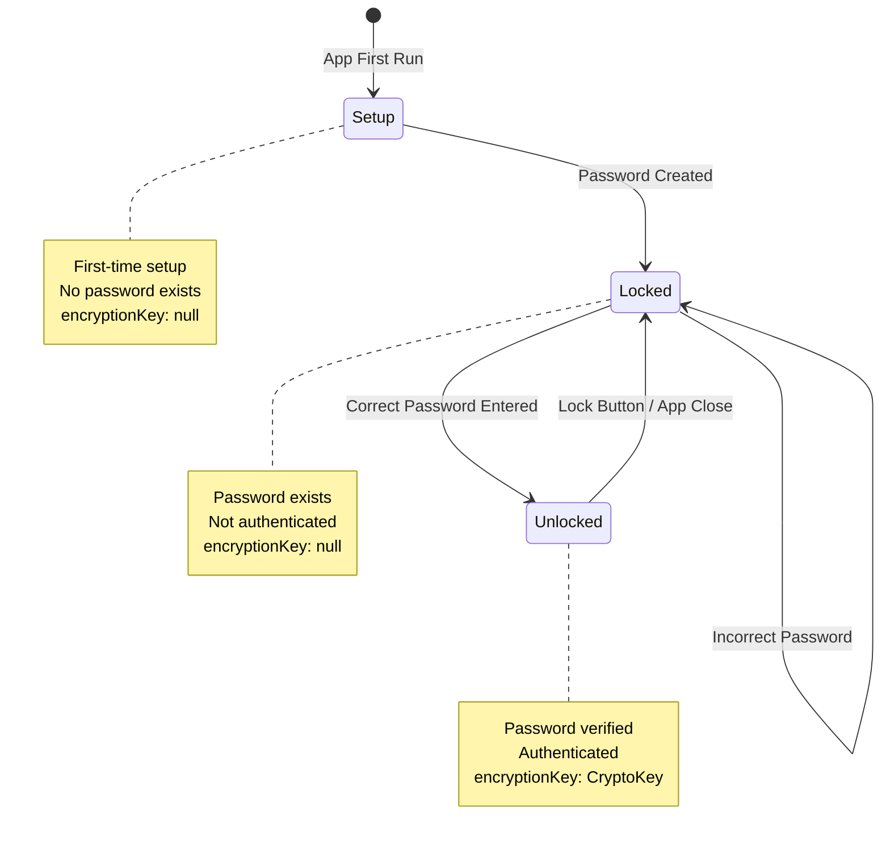

# State Machine Documentation

**Purpose:** Complete specification of application states, transitions, and guards  
**Use When:** Implementing features, debugging state issues, understanding app lifecycle  
**Last Updated:** 2025-12-30

---

## State Overview

Vault Budget operates as a strict 3-state finite state machine. Every feature must respect these states and their transition rules.



---

## State 1: SETUP

### Definition
First-run state when no master password has been set.

### Conditions
- Database setting `password_hash` does NOT exist
- OR `password_hash` value is null/undefined

### UI Visibility

**Visible:**
- `#setup-screen` - Password creation form

**Hidden:**
- `#unlock-screen`
- `#app-content` (main application tabs)
- `#bottom-nav` (tab navigation)

### User Capabilities

**Allowed Actions:**
- Enter master password (twice for confirmation)
- View informational text about encryption
- Submit setup form

**Prohibited Actions:**
- Access any financial data (none exists yet)
- Access any application features
- Lock/unlock (not applicable)

### Data State

**SecurityManager:**
- `encryptionKey`: `null`
- Password verification: Not applicable (no stored hash)

**DatabaseManager:**
- `password_hash` setting: Does not exist
- `password_salt` setting: Does not exist
- All tables: Empty (fresh database)

### Code Patterns

#### Check for Setup State
```javascript
async checkAppState() {
    const hashSetting = await this.db.getSetting('password_hash');
    
    if (!hashSetting || !hashSetting.value) {
        this.appState = 'setup';
        return;
    }
    
    // Otherwise, app is locked
    this.appState = 'locked';
}
```

#### Render Setup Screen
```javascript
render() {
    if (this.appState === 'setup') {
        document.getElementById('setup-screen').classList.remove('hidden');
        document.getElementById('unlock-screen').classList.add('hidden');
        document.getElementById('app-content').classList.add('hidden');
        document.getElementById('bottom-nav').classList.add('hidden');
    }
}
```

---

## State 2: LOCKED

### Definition
Password has been set, but user is not currently authenticated. Encryption key is NOT in memory.

### Conditions
- Database setting `password_hash` EXISTS
- AND `SecurityManager.encryptionKey` is `null`

### UI Visibility

**Visible:**
- `#unlock-screen` - Password entry form

**Hidden:**
- `#setup-screen`
- `#app-content`
- `#bottom-nav`

### User Capabilities

**Allowed Actions:**
- Enter password
- Submit unlock form
- View app branding/logo

**Prohibited Actions:**
- Access any financial data (encrypted, cannot decrypt)
- View transactions, budgets, categories, etc.
- Modify any data
- Use any application features

### Data State

**SecurityManager:**
- `encryptionKey`: `null` (key NOT in memory)
- Password verification: Possible (can compare with stored hash)

**DatabaseManager:**
- `password_hash` setting: EXISTS (Base64 PBKDF2 hash)
- `password_salt` setting: EXISTS (Base64 16-byte salt)
- Financial data: EXISTS but encrypted (cannot be read)

### Decrypt Operations
**Status:** ❌ FAIL  
**Behavior:** `security.decrypt()` throws error:
```javascript
Error: Encryption key not initialized
```

### Code Patterns

#### Check for Locked State
```javascript
async checkAppState() {
    const hashSetting = await this.db.getSetting('password_hash');
    
    if (hashSetting && hashSetting.value) {
        // Password exists, app is locked (until unlocked)
        this.appState = 'locked';
    }
}
```

#### Render Locked Screen
```javascript
render() {
    if (this.appState === 'locked') {
        document.getElementById('setup-screen').classList.add('hidden');
        document.getElementById('unlock-screen').classList.remove('hidden');
        document.getElementById('app-content').classList.add('hidden');
        document.getElementById('bottom-nav').classList.add('hidden');
    }
}
```

#### State Guard (Prevent Operations)
```javascript
async renderTransactions() {
    // STATE GUARD: Must be unlocked to decrypt
    if (!this.security.encryptionKey) {
        console.error('Cannot render transactions: App is locked');
        return; // Exit gracefully
    }
    
    // Safe to proceed (in unlocked state)
}
```

---

## State 3: UNLOCKED

### Definition
User has been authenticated, encryption key is in memory, full access to features.

### Conditions
- Database setting `password_hash` EXISTS
- AND `SecurityManager.encryptionKey` is NOT null (is CryptoKey)

### UI Visibility

**Visible:**
- `#app-content` - All application tabs
- `#bottom-nav` - Tab navigation
- Current active tab content

**Hidden:**
- `#setup-screen`
- `#unlock-screen`

### User Capabilities

**Allowed Actions:**
- ALL application features:
  - View/create/edit/delete transactions
  - Manage budgets
  - Configure categories/payees
  - Import/export CSV
  - View summaries/charts
  - Manage mappings
  - Adjust settings
- Lock the app (transition back to Locked)

**Prohibited Actions:**
- None (full access)

### Data State

**SecurityManager:**
- `encryptionKey`: `CryptoKey` (AES-GCM 256-bit key in memory)
- Derived from: User's password + stored salt
- Lifetime: Until lock or app close

**DatabaseManager:**
- All data accessible (can decrypt)
- CRUD operations fully functional
- Encryption/decryption work as expected

### Decrypt Operations
**Status:** ✅ SUCCESS  
**Behavior:** `security.decrypt()` successfully decrypts data:
```javascript
const plaintext = await security.decrypt(encrypted_data);
// Returns decrypted string
```

### Code Patterns

#### Check for Unlocked State
```javascript
// In most cases, check encryption key directly
if (this.security.encryptionKey) {
    // App is unlocked, safe to decrypt
}
```

#### Render Unlocked State
```javascript
render() {
    if (this.appState === 'unlocked') {
        document.getElementById('setup-screen').classList.add('hidden');
        document.getElementById('unlock-screen').classList.add('hidden');
        document.getElementById('app-content').classList.remove('hidden');
        document.getElementById('bottom-nav').classList.remove('hidden');
        
        // Render active tab
        this.ui.showTab(this.ui.currentTab || 'home');
    }
}
```

#### Feature Implementation
```javascript
async displayTransactions() {
    // STATE GUARD: Verify unlocked before proceeding
    if (!this.security.encryptionKey) {
        console.error('Cannot display: App must be unlocked');
        return;
    }
    
    // SECURITY: Decrypt all encrypted fields
    const transactions = await this.db.getAllTransactions();
    for (const tx of transactions) {
        const date = await this.security.decrypt(tx.encrypted_date);
        const amount = await this.security.decrypt(tx.encrypted_amount);
        const description = await this.security.decrypt(tx.encrypted_description);
        // ...render to UI
    }
}
```

---

## State Transitions

### Transition 1: Setup → Locked

**Trigger:** User submits setup form with valid password

**Sequence:**
```javascript
async handleSetupSubmit() {
    // 1. Validate password (length, confirmation match)
    if (password.length < 8) {
        alert('Password must be at least 8 characters');
        return;
    }
    
    if (password !== confirmPassword) {
        alert('Passwords do not match');
        return;
    }
    
    // 2. Create password hash
    const { hash, salt } = await this.security.createPasswordHash(password);
    
    // 3. Save to database
    await this.db.saveSetting('password_hash', hash);
    await this.db.saveSetting('password_salt', salt);
    
    // 4. Initialize encryption (unlock immediately)
    await this.security.initializeEncryption(password, salt);
    
    // 5. Trigger app state change
    this.onSetupSuccess(); // Callback to App class
}

// In App class
async onSetupSuccess() {
    this.appState = 'unlocked'; // Skip locked, go straight to unlocked
    this.render(); // Update UI
}
```

**State Changes:**
- `appState`: `'setup'` → `'unlocked'`
- `encryptionKey`: `null` → `CryptoKey`
- `password_hash` setting: Created
- `password_salt` setting: Created

**UI Changes:**
- Hide: `#setup-screen`
- Show: `#app-content`, `#bottom-nav`
- Show: Home tab (default)

**Note:** Setup transitions directly to Unlocked (not Locked) for better UX.

---

### Transition 2: Locked → Unlocked

**Trigger:** User enters correct password

**Sequence:**
```javascript
async handleUnlockSubmit() {
    const password = document.getElementById('unlock-password').value;
    
    // 1. Fetch stored hash and salt
    const hashSetting = await this.db.getSetting('password_hash');
    const saltSetting = await this.db.getSetting('password_salt');
    
    const storedHash = hashSetting.value;
    const storedSalt = saltSetting.value;
    
    // 2. Verify password
    const isValid = await this.security.verifyPassword(
        password,
        storedHash,
        storedSalt
    );
    
    if (!isValid) {
        // Wrong password - remain in locked state
        alert('Incorrect password');
        document.getElementById('unlock-password').value = '';
        return;
    }
    
    // 3. Password correct - initialize encryption
    await this.security.initializeEncryption(password, storedSalt);
    
    // 4. Trigger app state change
    this.onUnlockSuccess(); // Callback to App class
}

// In App class
async onUnlockSuccess() {
    this.appState = 'unlocked';
    this.render(); // Update UI
}
```

**State Changes:**
- `appState`: `'locked'` → `'unlocked'`
- `encryptionKey`: `null` → `CryptoKey`

**UI Changes:**
- Hide: `#unlock-screen`
- Show: `#app-content`, `#bottom-nav`
- Show: Last active tab (or Home if first unlock)

**Failed Attempt:**
- `appState`: Remains `'locked'`
- Show error message
- Clear password input
- Allow retry

---

### Transition 3: Unlocked → Locked

**Trigger:** User clicks lock button OR closes app

**Sequence:**
```javascript
async handleLock() {
    // 1. Clear encryption key from memory
    this.security.clearEncryptionKey();
    
    // 2. Update app state
    this.appState = 'locked';
    
    // 3. Re-render UI
    this.render();
}

// SecurityManager
clearEncryptionKey() {
    this.encryptionKey = null; // Remove from memory
}
```

**State Changes:**
- `appState`: `'unlocked'` → `'locked'`
- `encryptionKey`: `CryptoKey` → `null`

**UI Changes:**
- Hide: `#app-content`, `#bottom-nav`
- Show: `#unlock-screen`
- Clear all decrypted data from DOM

**Data Preservation:**
- Database: Unchanged (encrypted data remains)
- Settings: Unchanged (password hash remains)
- UI state: Lost (e.g., active tab, filters)

**Security Impact:**
- Decrypted data in memory is cleared
- Future decrypt attempts will fail
- User must re-enter password to access data

---

### Transition 4: Unlocked → Locked (App Close)

**Trigger:** Browser tab/window closes

**Sequence:**
```javascript
// Browser automatically clears all JavaScript variables
// No explicit code needed - encryption key is lost
```

**State Changes:**
- On next app open: Detect password exists → Start in Locked state
- `encryptionKey`: Lost (was in memory only)

**Behavior:**
- Next session starts in Locked state
- User must enter password again
- Zero-knowledge guarantee: Key never persisted

---

## State Guards (Required Patterns)

### Guard 1: Decrypt Operations

**Rule:** ALWAYS check encryption key before calling `decrypt()`

```javascript
// ✅ CORRECT
async renderData() {
    // STATE GUARD
    if (!this.security.encryptionKey) {
        console.error('[Feature]: Cannot decrypt - app is locked');
        return;
    }
    
    const data = await this.security.decrypt(encrypted);
    // ...
}

// ❌ WRONG - Will throw error if locked
async renderData() {
    const data = await this.security.decrypt(encrypted); // Crashes if locked
}
```

### Guard 2: Feature Visibility

**Rule:** Hide features that require decryption when locked

```javascript
// ✅ CORRECT
render() {
    if (this.appState === 'locked' || this.appState === 'setup') {
        // Don't render financial data
        return;
    }
    
    // Safe to render (unlocked state)
    this.renderTransactions();
}
```

### Guard 3: Button Availability

**Rule:** Disable/hide action buttons in inappropriate states

```javascript
// ✅ CORRECT
render() {
    const addButton = document.getElementById('add-transaction-btn');
    
    if (this.appState === 'unlocked') {
        addButton.disabled = false;
        addButton.style.display = 'block';
    } else {
        addButton.disabled = true;
        addButton.style.display = 'none';
    }
}
```

---

## State-Specific Feature Matrix

| Feature | Setup | Locked | Unlocked |
|---------|-------|--------|----------|
| Create password | ✅ | ❌ | ❌ |
| Enter password | ❌ | ✅ | ❌ |
| View transactions | ❌ | ❌ | ✅ |
| Create transaction | ❌ | ❌ | ✅ |
| Edit transaction | ❌ | ❌ | ✅ |
| Delete transaction | ❌ | ❌ | ✅ |
| View budget | ❌ | ❌ | ✅ |
| Manage categories | ❌ | ❌ | ✅ |
| Import CSV | ❌ | ❌ | ✅ |
| Export CSV | ❌ | ❌ | ✅ |
| View mappings | ❌ | ❌ | ✅ |
| Lock app | ❌ | ❌ | ✅ |

---

## Error Handling by State

### Setup State Errors

**Invalid Password:**
- Error: "Password must be at least 8 characters"
- Action: Show alert, clear inputs, allow retry
- State: Remains in Setup

**Password Mismatch:**
- Error: "Passwords do not match"
- Action: Show alert, clear confirmation field
- State: Remains in Setup

**Database Error:**
- Error: "Failed to save password"
- Action: Show alert, log error, allow retry
- State: Remains in Setup

---

### Locked State Errors

**Incorrect Password:**
- Error: "Incorrect password"
- Action: Show alert, clear input, allow retry
- State: Remains in Locked

**Database Error:**
- Error: "Failed to verify password"
- Action: Show alert, log error, allow retry
- State: Remains in Locked

---

### Unlocked State Errors

**Decrypt Failure:**
- Error: "Failed to decrypt data"
- Cause: Corrupted database or wrong key (shouldn't happen)
- Action: Log error, show user error, consider re-lock
- State: Consider transitioning to Locked for safety

**Database Operation Failure:**
- Error: "Failed to save transaction"
- Action: Show user error, allow retry
- State: Remains in Unlocked

---

## State Persistence Across Sessions

### First Launch (Ever)
1. Check database for `password_hash`
2. Not found → State: Setup
3. User creates password
4. Transition to Unlocked

### Subsequent Launch (After Setup)
1. Check database for `password_hash`
2. Found → State: Locked
3. User enters password
4. If correct → Transition to Unlocked
5. If incorrect → Remain in Locked

### After Locking
1. State: Locked
2. `encryptionKey` cleared from memory
3. Next unlock requires password re-entry

### After Closing App
1. Browser clears all JavaScript variables
2. `encryptionKey` lost (was never persisted)
3. Next launch: Detect `password_hash` → State: Locked
4. Requires password to unlock

---

## Security Implications by State

### Setup State
**Security Level:** Low
- No encrypted data exists
- No password set
- No encryption key
- **Risk:** None (fresh install)

### Locked State
**Security Level:** High
- Encryption key NOT in memory
- All data encrypted in database
- Cannot access financial data
- **Risk:** Minimal (zero-knowledge preserved)

### Unlocked State
**Security Level:** Medium
- Encryption key IN memory
- Data can be decrypted
- Full feature access
- **Risk:** If device compromised while unlocked, data accessible
- **Mitigation:** Auto-lock timeout (future feature), manual lock button

---

## Common State-Related Bugs

### Bug 1: Decrypt Without Guard
**Symptom:** Error "Encryption key not initialized"  
**Cause:** Calling `decrypt()` in locked/setup state  
**Fix:** Add state guard before decrypt

```javascript
// ❌ WRONG
const amount = await this.security.decrypt(tx.encrypted_amount);

// ✅ CORRECT
if (!this.security.encryptionKey) return;
const amount = await this.security.decrypt(tx.encrypted_amount);
```

---

### Bug 2: UI Visibility Not Updated
**Symptom:** App content visible while locked  
**Cause:** `render()` not called after state transition  
**Fix:** Always call `render()` after state change

```javascript
// ✅ CORRECT
async onUnlockSuccess() {
    this.appState = 'unlocked';
    this.render(); // Update UI
}
```

---

### Bug 3: State Check Out of Sync
**Symptom:** Features available in wrong state  
**Cause:** Checking `appState` string instead of `encryptionKey`  
**Fix:** Check encryption key directly for unlock requirement

```javascript
// ✅ BETTER (more reliable)
if (!this.security.encryptionKey) {
    console.error('Must be unlocked');
    return;
}

// ⚠️ OKAY (but less direct)
if (this.appState !== 'unlocked') {
    return;
}
```

---

## Best Practices

### 1. Always Use State Guards
```javascript
// Every method that decrypts should start with:
if (!this.security.encryptionKey) {
    console.error('[Method name]: Requires unlocked state');
    return;
}
```

### 2. Fail Gracefully
```javascript
// Don't throw errors to user for state violations
// Just log and return
if (!this.security.encryptionKey) {
    console.error('Cannot proceed: App is locked');
    return; // ✅ Silent failure
    // throw new Error('Locked'); // ❌ Don't crash
}
```

### 3. Check State at Entry Points
```javascript
// At the start of UI rendering methods
render() {
    if (this.appState !== 'unlocked') return;
    // Safe to proceed
}
```

### 4. Clear Sensitive Data on Lock
```javascript
async handleLock() {
    // Clear encryption key
    this.security.clearEncryptionKey();
    
    // Clear any cached decrypted data
    this.cachedTransactions = [];
    this.cachedCategories = [];
    
    // Update state
    this.appState = 'locked';
    this.render();
}
```

---

## Testing Checklist

For any new feature, test all three states:

- [ ] **Setup State:**
  - [ ] Feature hidden/disabled
  - [ ] No errors in console
  - [ ] No access to financial data

- [ ] **Locked State:**
  - [ ] Feature hidden/disabled
  - [ ] Decrypt operations blocked
  - [ ] No errors in console
  - [ ] Graceful degradation

- [ ] **Unlocked State:**
  - [ ] Feature fully functional
  - [ ] Data decrypts correctly
  - [ ] UI renders as expected
  - [ ] No state violations

- [ ] **State Transitions:**
  - [ ] Setup → Unlocked works
  - [ ] Locked → Unlocked works
  - [ ] Unlocked → Locked works
  - [ ] UI updates correctly on each transition

---

**Document Version:** 1.0  
**Last Updated:** 2025-12-30  
**Review Frequency:** When adding state-dependent features or modifying authentication flow
